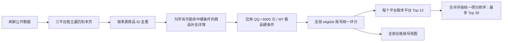

# 三平台完整分页与均衡 Top 30 候选池设计

## 目标

Delta Account Scout 每次刷新时，应尽量遍历交易猫、盼之代售和螃蟹账号当前筛选条件下所有公开可访问的分页。软件先汇总并去重全部商品，再对满足以下硬条件的账号使用同一套规则评分：

- QQ 官服；
- 价格不高于 6000 元；
- 拥有 M7 战斗步枪「棱镜攻势」，且品质明确为极品。

默认候选池采用用户确认的均衡规则：在全部合格账号已经完成统一评分后，从交易猫、盼之和螃蟹账号分别取本平台得分最高的 10 个，合并后再按统一得分排序，形成最多 30 个账号的跨平台候选池。某个平台不足 10 个真实合格账号时展示实际数量，不由其它平台补位，也不复制或伪造商品凑数。

## 与现有设计的关系

本设计是 `2026-07-28-delta-account-scout-design.md` 和 `2026-07-28-pxb7-public-api-collector-design.md` 的增量替代规格，并在以下冲突点拥有更高优先级：

- 用“遍历到平台自然末页 + 100 页/2000 摘要/500 详情异常安全上限”替换总设计中的“最多 3 页/60 摘要/20 详情”；
- 用同一通用安全上限替换螃蟹设计中的“最多 3 页/48 条”；
- 用“全部新鲜合格账号统一评分后，每平台 Top 10，合并为均衡 Top 30”替换旧设计中“默认展示全部 eligible”的行为；
- 用本设计的来源状态、API 视图和实时验收契约补充旧设计。
- 对旧设计“公开接口必须完全无需 Cookie”的规则增加一个仅适用于交易猫精确列表 API 的窄化例外：允许读取同一公开列表端点为匿名 H5 签名握手即时签发的 `_m_h5_tk` 和 `_m_h5_tk_enc`，只在当前来源刷新期间保存在内存并只回传给同一主机、同一 API；它们不得来自用户浏览器、登录会话或磁盘，也不得用于任何其它接口。

旧设计的硬条件、证据解析、评分权重、请求限速、只读安全边界、失败隔离和螃蟹字段契约在未被上述条目明确替换时继续有效。实施计划和验收测试必须同时引用本设计与仍有效的旧规格条款，不能继续保留旧上限。

## 已验证的当前问题

现有协调器把单来源扫描固定限制为 3 页、60 条摘要和 20 条详情。交易猫和盼之的适配器只识别 HTML 中的 `rel=next`，但两个站点当前页面都不提供这种链接，导致一次刷新只读取第一页。

2026-07-28 对用户已经设好的目标筛选进行只读现场核验：

| 来源 | 现有快照 | 实际可访问分页 | 已验证唯一商品数 | 正确停止信号 |
| --- | ---: | ---: | ---: | --- |
| 交易猫 | 16 | 约 26（随库存变化） | 宽化接口现场报告 `totalCnt=406` | 签名列表接口 `hasNextPage === "false"` |
| 盼之代售 | 10 | 5 次请求 | 30 | 新页不再产生新商品 ID |
| 螃蟹账号 | 32 | 2 | 32 | 响应不再返回新的 `pageToken` |

交易猫的普通 `?page=2` URL 会重复第一页，真实网页通过公开前端代码调用 `mtop.com.jym.layout.pc.goodslist.getUnifiedGoodsList`。该接口使用匿名 H5 Token 签名握手；不需要用户登录态。最初用户页面还额外选择了“可二次实名”和极品 S/A，现场验证该窄筛选为 3 页、35 条；二次实名不是硬条件，且领域模型允许极品 S/A/B/C，因此最终采集条件必须移除“可二次实名”并包含极品 S/A/B/C。宽化条件现场返回 `totalCnt=406`、第一页 16 个唯一商品和 `hasNextPage=true`，最终唯一数与页数以实现后的自然末页刷新为准。

盼之当前接受 `/goodsList/391/6?page=N`。第 1–5 页分别产生 10、8、8、4、0 个新商品，累计 30 个唯一商品；第五页虽然仍能返回卡片，但全部与前面重复，因此“本页无新增 ID”是可靠的保守停止信号。

螃蟹公开 JSON 接口当前第一页和第二页各返回 16 条；第二页没有新的分页 Token，现有适配器已经能够正确遍历到末页。

## 方案比较

### 方案 A：按来源的真实分页协议遍历到末页（采用）

每个适配器生成平台认可的下一页请求，协调器统一负责去重、重复请求防护、无新增停止、安全上限和完整性状态。优点是能覆盖当前全部可访问库存，同时保留来源隔离和可测试性。

### 方案 B：只提高固定页数和条数上限

该方案仍无法让交易猫和盼之产生第二页请求，也不能区分“自然结束”与“被上限截断”。不采用。

### 方案 C：在用户已登录浏览器中滚动并抓取 DOM

该方案依赖交互会话，交易猫和螃蟹页面已经出现 DOM 读取超时，且会把刷新能力绑定到登录状态。不采用；浏览器只用于最终人工核验和本地应用验收。

## 总体数据流



三个来源仍依次刷新，单来源失败不阻塞其它来源。评分必须在三个来源都完成或明确失败之后统一计算，不能逐来源使用不同的价格或资产归一化范围。

## 完整分页语义

### 通用协调器

协调器不再把 3 页、60 条摘要和 20 条详情当作正常结束条件。每个来源循环直到满足以下任一条件：

1. 适配器返回 `nextPage === null`；
2. 下一页请求指纹与已访问请求重复；
3. 当前成功页面没有产生新的来源商品 ID；
4. 请求、解析或访问受阻；
5. 命中安全上限。

请求指纹继续由 `method + url + body` 组成。商品在单来源内以 `sourceListingId` 为首选身份，没有稳定 ID 时退化为规范化 URL。同一商品在多个分页出现时只保留一份；跨平台商品仍不自动合并，只标记“可能重复”。

安全上限设置为单来源最多 100 页、2000 条唯一摘要和 500 个详情请求。上限仅用于防止平台异常循环，不能作为预期停止方式。触发上限、后续页失败或解析受阻时保存已经取得的数据并标记 `partial`；只有适配器自然结束、重复请求保护或无新增 ID 停止且此前没有错误时才标记 `success`。

详情获取不再固定只取前 20 个。所有满足“价格未知或不超过 6000，且摘要存在 M7 与棱镜攻势线索”的商品都应尝试详情；嵌入式详情继续直接使用。命中 500 个详情安全上限时剩余记录进入待人工核验，来源标记 `partial`。

### 交易猫

第一页和 MTop `Referer` 必须使用适配器的同一个固定 `entryUrl`。该值也是 fixture 和请求测试必须断言的绝对 URL：

```text
https://www.jiaoyimao.com/jg2007840/f8845003-c8845004/o110/?searchCondition=%7B%22attr_7393855783477590029%22%3A%7B%22selectType%22%3A2%2C%22multiSearchCondition%22%3Atrue%2C%22conditionList%22%3A%5B%5D%2C%22childCondition%22%3A%7B%22mp_7393855783922186253%22%3A%7B%22%E6%9E%81%E5%93%81%7CS%22%3A%5B%22M7%E6%88%98%E6%96%97%E6%AD%A5%E6%9E%AA-%E6%A3%B1%E9%95%9C%E6%94%BB%E5%8A%BFS2%22%5D%2C%22%E6%9E%81%E5%93%81%7CA%22%3A%5B%22M7%E6%88%98%E6%96%97%E6%AD%A5%E6%9E%AA-%E6%A3%B1%E9%95%9C%E6%94%BB%E5%8A%BFS2%22%5D%2C%22%E6%9E%81%E5%93%81%7CB%22%3A%5B%22M7%E6%88%98%E6%96%97%E6%AD%A5%E6%9E%AA-%E6%A3%B1%E9%95%9C%E6%94%BB%E5%8A%BFS2%22%5D%2C%22%E6%9E%81%E5%93%81%7CC%22%3A%5B%22M7%E6%88%98%E6%96%97%E6%AD%A5%E6%9E%AA-%E6%A3%B1%E9%95%9C%E6%94%BB%E5%8A%BFS2%22%5D%7D%7D%2C%22statConditionList%22%3A%5B%5D%2C%22conditionType%22%3A3%7D%7D&enforcePlat=2&newPage=true
```

第一页从该 URL 读取 SSR 商品卡，避免额外接口请求。若第一页有商品，下一页改为页面实际使用的公开只读 MTop 请求：

- 方法与地址：`POST https://mtop.jiaoyimao.com/h5/mtop.com.jym.layout.pc.goodslist.getunifiedgoodslist/1.0/`
- API 名：`mtop.com.jym.layout.pc.goodslist.getunifiedgoodslist`
- 版本：`1.0`
- `appKey`：`12574478`
- `pageSize`：`16`
- `modelType`：`h5`
- 页码从字符串 `"2"` 开始递增。

每次请求的 URL 查询参数固定为：

```text
jsv=2.7.2
appKey=12574478
t={13 位毫秒时间戳}
sign={32 位小写 MD5}
api=mtop.com.jym.layout.pc.goodslist.getunifiedgoodslist
v=1.0
type=original
dataType=json
```

POST 请求头固定为：

```text
Accept: application/json
Content-Type: application/x-www-form-urlencoded
Origin: https://www.jiaoyimao.com
Referer: {上述固定 entryUrl 的完整原值}
User-Agent: DeltaAccountScout/0.1 (+local personal comparison tool)
jym-meta-h5: {下述单行 JSON}
x-ua: DeltaAccountScout/0.1 (+local personal comparison tool)
Cookie: _m_h5_tk={匿名 Token 值}; _m_h5_tk_enc={匿名校验值}
```

`jym-meta-h5` 使用网页已验证的字段形状：

```json
{
  "sid": "{200 至 599 的随机整数}{13 位毫秒时间戳}",
  "ssids": "{与 sid 相同}",
  "ch": "",
  "plat": "JYM_IOS_TOUCH",
  "platform": "JYM_IOS_TOUCH",
  "terminal": "pc",
  "osCode": "other",
  "chCode": "h5",
  "ieuAppCode": "",
  "webEntryType": "",
  "ttidExtInfo": "#H5"
}
```

POST body 只有一个 `data` 表单字段。先构造下列对象，其中 `searchCondition` 和 `gameCondition` 已经是 JSON 字符串，不能再次按对象转义；然后对整个对象执行一次 `JSON.stringify`，最后用标准 `application/x-www-form-urlencoded` 编码为 `data={百分号编码后的 JSON 文本}`：

```json
{
  "searchCondition": "{\"attr_7393855783477590029\":{\"selectType\":2,\"multiSearchCondition\":true,\"conditionList\":[],\"childCondition\":{\"mp_7393855783922186253\":{\"极品|S\":[\"M7战斗步枪-棱镜攻势S2\"],\"极品|A\":[\"M7战斗步枪-棱镜攻势S2\"],\"极品|B\":[\"M7战斗步枪-棱镜攻势S2\"],\"极品|C\":[\"M7战斗步枪-棱镜攻势S2\"]}},\"statConditionList\":[],\"conditionType\":3}}",
  "relateId": "10101",
  "pageSize": 16,
  "modelType": "h5",
  "queryType": 1,
  "goodsScene": "goods_search_new",
  "gameCondition": "{\"gameId\":2007840,\"platformId\":2,\"clientId\":110}",
  "categoryId": 8845004,
  "parentId": 8845003,
  "class": "com.jym.delivery.hsf.dto.unifiedgoodslist.GoodsListQueryParams",
  "page": "2"
}
```

后续页只修改 `page` 字符串；筛选条件、游戏 ID、客户端 ID、平台 ID、分类 ID 和父分类 ID 不得改变。`searchCondition` 不得重新加入二次实名或其它评分项作为硬预筛选。上述对象等价于网页的 `needFormatMtopDate` 行为：原始嵌套对象先各自 `JSON.stringify`，再序列化最外层 `data`。

MTop H5 签名使用网页自身的匿名握手：

1. 首次请求不带 Cookie，Token 视为空字符串，仍按完整公式生成签名并发送上述精确请求；
2. 接受预期的 `FAIL_SYS_TOKEN_EMPTY` 响应，并只从 `Set-Cookie` 读取平台签发的 `_m_h5_tk` 和 `_m_h5_tk_enc`；
3. 取 `_m_h5_tk` 下划线前的 Token，按 `md5(token + "&" + t + "&" + appKey + "&" + data)` 生成签名；
4. 使用新的 `t`、重新计算的 `sign` 和同一份未重新编码的 `data` JSON 文本，携带两个匿名 Cookie 重发该只读列表请求；
5. Token 只保存在采集器内存，不写入 SQLite、日志、证据、配置或浏览器，不读取或复用用户的登录 Cookie。

签名输入中的 `data` 是 URL 编码前的完整 JSON 文本，编码顺序固定为“构造内层 JSON 字符串 → 外层 `JSON.stringify` → 计算 MD5 → 表单百分号编码”。Token 失效响应允许清除内存 Cookie 并重新握手一次；仍失败则按来源失败或部分失败处理。不得把 Cookie 合并字符串输出到日志，也不得调用商品操作、收藏、沟通、下单或支付 API，或尝试相邻接口。

成功响应只接受 `ret` 为字符串数组且包含 `SUCCESS::调用成功`、`data.result` 为对象、`data.result.deliverComps` 为数组、`data.result.hasNextPage` 为布尔值或字符串 `"true" | "false"` 的结构。MTop `deliverComps` 中只有结构明确、能解析出纯数字 `goodsId`、有限非负价格、标题和本站商品 URL 的商品组件进入摘要；页面装饰、广告或缺少身份字段的组件忽略。分页以响应的 `hasNextPage` 为权威；如果它为真但下一页无新 ID，通用无新增保护停止并记录成功。

### 盼之代售

第一页继续读取当前公开目录 `/goodsList/391/6`。后续请求保留当前 URL 的其它查询参数，只把 `page` 设置为当前页码加一。

盼之页面没有可信的总页数或下一页链接，因此适配器在每个成功页面后生成下一个页码；通用协调器在“本页无新增商品 ID”时停止。这能容忍站点尾页重复上一批商品，也避免无限翻页。

页面返回空列表时视为自然结束。页面结构变化、验证码或非成功响应按已有失败规则处理。

### 螃蟹账号

继续使用已经批准并验证的公开只读 JSON 接口和响应 `pageToken`。只要 Token 非空、与当前 Token 不同且能产生新的请求指纹，就继续下一页；Token 缺失或重复时自然结束。

取消旧设计中的“最多 3 页”正常限制，改用通用 100 页安全上限。当前现场数据为 2 页、32 条。

## 统一评分与候选池

硬条件分类逻辑保持：

- `loginPlatform === "qq"`；
- `service === "official"`；
- `priceCny !== null && priceCny <= 6000`；
- `m7PrismStatus === "peak"`。

只有 `eligibility === "eligible"` 的账号参与评分。现有安全、价格、资产和置信度四部分及并列规则保持不变，但归一化候选集合必须是三个平台当轮全部 `eligible` 账号。

新增纯函数 `selectBalancedCandidatePool(listings, perSourceLimit = 10)`：

1. 输入使用统一评分后的全部 Listing；
2. 过滤 `eligible` 且存在有效分数；
3. 按现有统一排序规则排序；
4. 每个平台独立保留前 10 个；
5. 将最多 30 个结果再次按同一统一排序规则排序；
6. 返回结果不得包含重复 `listing.key`。

默认 `/api/listings` 返回候选池；显式 `view=all` 返回所选状态下的全部记录。为避免旧调用含义模糊，前端和测试统一显式传：

- `view=pool&status=eligible`：默认均衡 Top 30；
- `view=all&status=eligible`：全部合格账号；
- `view=all&status=needs_verification`：待人工核验；
- `view=all&status=rejected`：已淘汰。

API 参数契约：

- `status` 允许 `eligible | needs_verification | rejected`，省略时默认 `eligible`；
- `view` 允许 `pool | all`；
- 同时省略 `view` 和 `status` 时等价于 `view=pool&status=eligible`；
- 只省略 `view` 时，`status=eligible` 默认 `pool`，其它两个状态默认 `all`，兼容现有只传状态的客户端；
- 只省略 `status` 时按默认 `eligible` 处理；
- 显式 `view=pool` 只允许与 `status=eligible` 组合；
- 未知 `view`、未知 `status` 或 `pool + 非 eligible` 返回 HTTP 400 和稳定错误码 `invalid_listing_view`，不能静默退化。

候选池不足 30 条时显示实际数量，并在界面标明每个平台贡献数量。全部合格视图不应用每平台 10 条限制。

## 来源状态与界面

数据库继续以现有 `source_status.state` 作为唯一持久化状态，允许值保持 `idle | success | partial | blocked | failed`，不新增第二个容易冲突的状态列。只新增并持久化：

- `pagesScanned`：本轮成功解析的列表页数；
- `itemCount`：数据库当前保留的最近有效来源快照商品数；本轮成功或部分成功替换快照时更新，入口即失败并保留旧 Listing 时保持旧值；
- `stopReason`：例如 `end_of_pages`、`no_new_items`、`repeated_request`、`safety_limit`、`captcha_required` 或结构错误。

API 的来源视图额外返回派生字段：

- `eligibleCount`：当前可参与统一评分的来源商品中，`eligibility === "eligible"` 的数量；
- `candidateCount`：当前进入均衡候选池的数量，范围 0–10；
- `completion`：`state=success` 映射为 `complete`，`partial | blocked | failed` 保持同名，`idle` 映射为 `idle`。

SQLite 启动迁移使用幂等 `ALTER TABLE` 补充 `pages_scanned INTEGER NOT NULL DEFAULT 0` 与可空 `stop_reason TEXT`，保留旧行的 `state`、`item_count` 和时间戳。旧行启动后 `pagesScanned=0`、`stopReason=null`；未扫描来源继续为 `idle`。入口失败时重置本轮 `pagesScanned=0`，但不删除旧 Listing，也不把 `itemCount` 伪装成当前尝试取得的数量。

`eligibleCount` 和 `candidateCount` 不写入数据库，避免它们在统一评分前失真。每轮三来源尝试完成后，协调器先在一个派生更新事务中写回所有新鲜 Listing 的统一分数，再由 API/Repository 使用同一个 `selectBalancedCandidatePool` 结果动态计算两个数量；因此来源卡、候选 API 和全部合格 API 使用同一候选定义。

前端默认状态标签改为：

- `推荐候选`：均衡 Top 30；
- `全部合格`；
- `待人工核验`；
- `已淘汰`。

来源卡在 `success/partial` 时显示“本轮页数 / 去重商品 / 合格 / 入选”及完整性；在入口即 `blocked/failed` 时明确显示“本轮 0 页 · 保留旧快照 N 条 · 不参与当前候选”，其中 N 为 `itemCount`。候选表标题显示实际总数与每平台贡献，例如“推荐候选 23 / 30 · 交易猫 10 · 盼之 3 · 螃蟹 10”。部分采集时给出醒目标记，不能把候选池描述为覆盖平台全部库存。

## 数据与安全边界

- 只调用网页自身已公开使用且现场验证过的只读列表请求；
- 不读取 Codex 浏览器 Cookie、localStorage、密码、实名资料或登录会话；
- 交易猫匿名 MTop Token/Cookie 只允许由上述精确公开列表端点在当前刷新中签发，只在内存中使用并仅回传给同一端点；不得读取或复用用户浏览器 Cookie、登录会话或其它域 Cookie；
- 螃蟹分页 Token 只在内存中使用；
- 不保存请求 Cookie、签名、分页 Token 或响应中的跟踪字段；
- 不绕过验证码、安全拦截、登录墙或频率限制；
- 继续保持单来源至少 2 秒的列表/详情节流、15 秒超时、一次网络重试和 2 MB 响应限制；
- 不自动收藏、沟通、下单或支付，最终购买由用户在原平台人工完成。

## 错误与快照规则

- 第一页失败：保留最近有效快照，来源标记 `blocked` 或 `failed`；
- 后续页失败：保存本轮已取得数据，来源标记 `partial`；
- 详情失败：保留摘要并记录警告；如果硬条件仍无法确认则进入待人工核验；
- 成功空库存：保存成功空快照；
- 交易猫匿名签名或响应结构变化：明确标记结构/签名错误，不退化为重复第一页；
- 数据库写入失败：本轮不覆盖旧快照；
- 某来源失败不妨碍其它来源完成和统一评分；失败来源保留旧快照时，其数据必须显示陈旧时间。

每轮刷新开始时记录统一的 `refreshStartedAt`。只有本轮结果为 `success` 或 `partial` 且该来源快照的 `capturedAt >= refreshStartedAt`，其 Listing 才属于“新鲜集合”，参与本轮三平台统一评分、每平台 Top 10 和默认候选池。入口即 `blocked`/`failed` 的来源保留旧 Listing 供 `view=all` 查阅，但旧 Listing 的 `score` 在派生更新中清空为 `null`，不进入默认候选池，也不影响价格或资产归一化；界面显示来源失败和旧快照时间。部分成功来源使用本轮已取得的新快照参与评分，同时显示 `partial` 警告。

## 测试策略

自动化测试不访问网络，新增最小脱敏夹具并覆盖：

1. 交易猫 MTop 匿名 Token 握手、签名公式、嵌套数据格式化和 Token 失效重试；
2. 交易猫第 1 页 HTML 与后续页 JSON 能产生正确且不重复的摘要；
3. 交易猫 `hasNextPage=false` 自然停止，真值但无新增 ID 时保护停止；
4. 盼之按 `page=N` 递增并在无新增商品时停止；
5. 螃蟹持续使用真实 `pageToken`，不再被 3 页上限截断；
6. 协调器能遍历超过 3 页和超过 60 条摘要；
7. 请求重复、商品重复、后续页失败和三个安全上限产生正确状态；
8. 超过 20 个可能命中商品时仍逐一尝试详情，除非达到 500 个安全上限；
9. 评分归一化使用三平台全部合格账号，而不是单个平台；
10. 每个平台只取本平台前 10 个，合并后全局排序，平台不足时不补位；
11. API 的 `pool` 与 `all` 视图边界；
12. SQLite 旧库迁移和来源统计字段；
13. 前端四个视图、候选数量和来源完整性展示；
14. 类型检查、生产构建和现有回归测试全部通过。

## 实时验收

实现完成后，以新的本地数据库或明确记录的刷新前后快照运行一次真实刷新，并保存以下可复核证据：

1. 交易猫使用不含二次实名限制、包含极品 S/A/B/C 的宽化条件读取当前全部可访问页；现场接口曾报告 `totalCnt=406`，库存变化时以 `hasNextPage`、实际唯一数和自然末页为准；
2. 盼之持续翻页直到空页或无新增 ID；现场基准为 30 条唯一商品；
3. 螃蟹持续使用分页 Token 到末页；现场基准为 2 页、32 条；
4. 每个平台状态显示实际页数、去重数量、合格数量、入选数量和完整性；
5. 候选池每个平台最多 10 个、总数最多 30，并按统一分数降序；
6. 每个候选都满足 QQ 官服、价格不高于 6000 和 M7「棱镜攻势」极品；
7. “全部合格”能看到未入选 Top 10 的其它合格账号；
8. Codex 浏览器中的 `http://127.0.0.1:4311/` 保持可用，刷新后界面与 API/SQLite 结果一致；
9. 不执行任何平台登录、收藏、沟通、购买或支付操作。

## ADR：完整遍历优先，安全上限只作异常保护

**状态：** 已批准  
**决定：** 按各来源真实分页协议遍历到自然末页，并以重复请求、无新增商品和高安全上限防止异常循环。  
**原因：** 固定读取少量页会系统性漏掉可比较账号，导致评分样本和候选池失真。  
**代价：** 真实刷新耗时增加，平台接口变化会使单来源进入部分状态。  
**缓解：** 来源级节流、严格只读请求、旧快照保留、完整性可见、离线契约测试和实时验收。

## ADR：统一评分后每平台 Top 10

**状态：** 已批准  
**决定：** 三个平台的全部合格账号使用同一候选集合和规则评分，再从每个平台分别取 Top 10，合并为最多 30 个候选。  
**原因：** 用户要求候选池同时具备跨平台可比性和每个平台 10 个名额。  
**代价：** 某个平台的第 10 名可能低于另一平台未入池的第 11 名；候选池不是纯粹的全局前 30。  
**缓解：** 默认池明确标为“均衡 Top 30”，并提供“全部合格”视图供用户查看所有统一评分结果。
