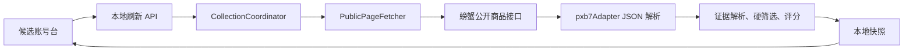

# 螃蟹账号公开接口采集设计

## 目标

让 Delta Account Scout 不再依赖螃蟹账号的客户端页面 DOM，而是通过页面自身使用的公开只读商品接口采集《三角洲行动》账号。采集结果继续进入现有标准化、硬条件分类和评分流程，并支持：

- QQ 登录；
- 价格不超过 6000 元；
- M7 战斗步枪「棱镜攻势 S2」且品质为极品；
- 展示极品等级、角色红皮、巨浪、总资产、哈夫币和实名状态；
- 在接口连续返回有效下一页标记时，每次刷新最多读取 3 页、48 个螃蟹商品，库存足够时提供至少 20 个合格候选。

库存数量会随平台实时变化。软件不得伪造或重复商品来凑满 20 条；当真实合格库存不足时，应展示实际数量。

## 已确认的根因

螃蟹账号列表页是 `serverRendered: false` 的 Nuxt 客户端应用，初始 HTML 只有应用挂载节点和脚本引用。现有采集器只执行普通 HTTP GET 并解析 HTML，不运行客户端 JavaScript，因此适配器只能返回 `blocked/unverified_structure`。

Codex 应用内浏览器对该页面的导航、DOM 读取和截图也会持续超时，不能作为稳定的后台数据源。

## 方案比较

### 方案 A：公开只读接口采集（采用）

从螃蟹公开页面脚本中确认其商品列表请求，按网页实际使用的请求结构获取 JSON。优点是字段完整、无需登录、无需执行重型页面、可稳定分页和测试。风险是接口属于站点实现细节，版本变化时需要更新适配器。

### 方案 B：浏览器自动化

在已登录页面中读取商品卡。该方案已经出现导航、局部 DOM 和截图三类超时；它依赖浏览器会话，运行速度慢且难以无人值守，不采用。

### 方案 C：手动复制或粘贴导入

由用户复制页面文本后导入。该方案安全但操作成本高，无法满足自动刷新要求，仅保留为将来的降级选项，本次不实现。

## 架构

现有系统继续保持单体本地 Web 应用和来源隔离结构。改动限制在采集层，不新增浏览器依赖。



### 通用请求能力

`PageFetcher.fetchPage` 增加可选的只读请求描述：

- 方法仅允许 `GET` 或 `POST`；
- 允许设置 `Accept`、`Content-Type`、`Origin` 和 `Referer`；
- POST 请求体由来源适配器构造；
- 继续应用现有 15 秒超时、单来源 2 秒间隔、最多重试一次和 2 MB 响应限制。

其他来源返回只有 URL 的请求描述，不设置 `options`，行为保持为普通 GET。

### 螃蟹适配器

螃蟹公开首页当前包含可见的 `/buy/10371/1`《三角洲行动》链接。适配器先从首页确认该目录存在，再返回预注册的列表 `SourceRequest`；首页检查失败时不得调用接口。该请求指向已从一方公开页面代码观察并验证为无需认证的只读接口：

`POST https://api-pc.pxb7.com/api/search/product/v2/selectSearchPageList`

固定搜索参数：

- `query`: `M7战斗步枪-棱镜攻势S2 极品`
- `gameId`: `10371`
- `bizProd`: `1`
- `pageSize`: `16`
- `type`: `4`
- `posType`: `1`

第一页不传 `pageToken`；后续页只使用前一页响应中 `data.properties.pageToken` 返回的非空字符串。最多读取 3 页，沿用协调器的页数上限。若 Token 缺失、与当前请求 body 中的 Token 相同或会生成已访问过的请求指纹，则成功停止分页，不能猜测下一页。

公开接口是对总设计中“不得猜测或调用未公开内部 API”的窄化例外：只有同时满足“由一方公开页面代码直接调用、无需登录、无需 Cookie 或 Token、只读商品查询、请求形状已经现场验证”的接口才能预注册；不得据此尝试相邻路径或其它操作。

### 类型契约

请求 URL、方法、请求头和请求体必须作为一个不可变描述一起在协调器与适配器之间传递，不能把分页 Token 放入全局可变状态。交易猫和盼之只返回含 URL 的描述，因此仍执行 GET：

```ts
interface PublicRequestOptions {
  method?: "GET" | "POST";
  accept?: string;
  contentType?: string;
  origin?: string;
  referer?: string;
  body?: string;
}

interface SourceRequest {
  url: string;
  options?: PublicRequestOptions;
}

interface PageFetcher {
  fetchPage(
    request: SourceRequest,
    source: SourceId
  ): Promise<FetchResult>;
}

interface ListingSummary {
  // 现有字段保持不变
  embeddedDetail?: ListingDetail;
}

type DiscoveryResult =
  | { kind: "ok"; request: SourceRequest }
  | { kind: "blocked"; reason: string };

interface SourceAdapter {
  source: SourceId;
  entryUrl: string;
  discoverCatalog(content: string, query: string): DiscoveryResult;
  parseList(content: string): ListParseResult;
  nextPage(
    content: string,
    currentRequest: SourceRequest
  ): SourceRequest | null;
  detailRequest(summary: ListingSummary): SourceRequest;
  parseDetail(
    content: string,
    summary: ListingSummary
  ): DetailParseResult;
}
```

`FetchResult.kind === "ok"` 继续用现有 `html` 字段承载响应文本，避免扩大无关重构；螃蟹 `parseList` 把它作为 JSON 解析。协调器用 `{ url: adapter.entryUrl }` 构造入口 GET，随后逐页传递 `DiscoveryResult.request` 或 `nextPage` 返回的完整 `SourceRequest`。`options.method` 缺省为 GET。

螃蟹 `nextPage` 同时读取当前响应的 `data.properties.pageToken` 和 `currentRequest.options.body` 中的 `pageIndex`，返回一个新的 `SourceRequest`，其 POST body 使用 `pageIndex + 1` 和新的 Token。适配器不得保存页码或 Token。协调器在单次来源刷新内部维护 `Set<method + url + body>` 请求指纹，拒绝重复请求；该 Set 是方法局部状态，因此并发刷新不会串页。

螃蟹列表请求使用以下精确参数：

```json
{
  "query": "M7战斗步枪-棱镜攻势S2 极品",
  "gameId": "10371",
  "pageIndex": 1,
  "pageSize": 16,
  "bizProd": 1,
  "type": "4",
  "posType": 1
}
```

第二页和第三页只额外加入前一页返回的 `pageToken`，并递增 `pageIndex`。允许的固定请求头为：

```text
Accept: application/json, text/plain, */*
Content-Type: application/json
Origin: https://www.pxb7.com
Referer: https://www.pxb7.com/
```

响应必须满足 `success === true`、`data` 为对象且 `data.list` 为数组。商品只读取以下已验证字段：`productId`、`bizProd`、`gameId`、`gameName`、`price`、`showTitle`、`productUniqueNo`、`guarantee` 和 `data.properties.pageToken`。无效 JSON、`success !== true` 或字段类型不符都返回 `blocked/structure_changed`，不得把它们当成空成功。

适配器把每个 JSON 商品转换为统一摘要：

- `productId` → 来源商品 ID；
- `price / 100` → 人民币价格；
- `showTitle` → 分段后的原始证据；
- `productId` 必须是纯数字字符串，`bizProd` 必须是字符串或数字 `1`，二者构造绝对链接 `https://www.pxb7.com/product/{productId}/1`；只允许同主机正常重定向；
- 同一商品明确出现 `QQ登录` 时直接写入 `loginPlatform: "qq"` 和 `service: "official"`；明确出现 `微信登录` 时写入 `loginPlatform: "wechat"` 和 `service: "unknown"`；两者同时出现或都未出现时均为未知；
- `总资产`、`哈夫币`、`可二次实名`等字段从证据解析；
- `guarantee` 不能直接等同于找回包赔，除非文本明确写出包赔，否则保持未知。

列表 JSON 已包含完成硬条件分类和用户所需展示的证据，因此每个有效商品摘要必须携带 `embeddedDetail`。协调器收到嵌入式详情后直接合并并禁止再次请求商品详情页；没有嵌入式详情的其它来源保持原流程。

### 证据处理

螃蟹的 `showTitle` 可能超过单条证据 2000 字限制。适配器必须按页面中的栏目边界拆成多条证据，再交给现有解析器，避免后半段的 M7、巨浪或资产信息被截断。

M7 目标名称必须是同一条证据中的精确 `M7战斗步枪-棱镜攻势`，允许可选的 `S2` 后缀和中英文括号。紧随其后的品质包含 `极品` 才映射为 `peak`；包含 `优品` 映射为 `premium`。`M7棱镜幻影`、其它仅含“棱镜”的 M7 名称、其它武器的极品和跨证据拼接都不能成为 `peak`。搜索词中的 `S2` 只是目标皮肤在螃蟹当前数据中的名称变体，不新增独立硬条件。

硬条件仍由领域层统一判断：

- `loginPlatform === "qq"`
- `service === "official"`
- `priceCny <= 6000`
- `m7PrismStatus === "peak"`

不得在适配器中伪造 `eligible` 状态。

## 数据与安全边界

- 只读取公开商品数据；
- 不读取或保存 Cookie、Token、localStorage、密码或验证码；
- 不复用用户登录态；
- 不调用下单、收藏、议价、聊天或支付接口；
- 不绕过验证码、访问控制或安全拦截；
- 单次刷新最多 3 个列表请求，保持每次至少 2 秒间隔；
- 原平台链接只用于用户最终人工核验和交易。

## 错误处理

- 非 2xx、超时或超出 2 MB：标记该来源失败；
- 响应出现验证码或安全验证文本：标记 `blocked/captcha_required`；
- 无效 JSON、`success !== true` 或字段结构不符合已验证契约：标记 `blocked/structure_changed`；
- 接口成功且 `data.list` 为空：保存成功的空快照，不伪报阻塞；
- 第二页或第三页失败且已有商品：保存已获得数据并标记 `partial`；
- 刷新失败时保留最近一次成功快照，其他来源继续工作；
- `pageToken` 缺失时停止分页，不猜测下一页参数。

## 测试

测试不得访问网络。保存最小、脱敏的公开 JSON fixture，覆盖：

1. Fetcher 能按适配器请求描述发送 JSON POST，同时保留节流、超时、重试和大小限制。
2. 螃蟹适配器能解析价格分、商品链接、QQ/微信、极品等级、红皮、巨浪、资产和实名字段。
3. 分页只使用响应中的真实 `pageToken`；无 Token、重复 Token 或重复请求指纹时停止，两个并发刷新不会共享游标。
4. 无效 JSON 或字段结构变化返回明确阻塞/失败状态。
5. 协调器优先使用嵌入式详情，不再请求客户端商品详情页。
6. `QQ登录` 直接映射 QQ 官服；微信、双登录和未知登录不能进入合格候选。
7. 只有精确 M7「棱镜攻势」极品进入 `peak`；其它“棱镜”名称、优品和跨字段品质为反例。
8. 商品链接严格构造为 `https://www.pxb7.com/product/{纯数字 productId}/1`。
9. 保存的三页验证 fixture 共 48 条，其中至少 20 条满足硬条件并进入 `eligible`。
10. 完整单元测试、类型检查和生产构建通过。

## 验收

以本地运行结果作为最终证据：

- 螃蟹来源状态不再是 `unverified_structure`；
- 当连续存在有效下一页 Token 时，一次刷新读取 3 页、最多 48 个不重复商品；库存提前结束时保存实际数量；
- 离线三页验证 fixture 中合格候选不少于 20 条；实时库存只展示实际合格数量；
- 每个合格候选都满足 QQ、价格不超过 6000、M7 棱镜攻势极品；
- 详情面板展示 M7 品质、识别出的角色红皮、巨浪状态、资产和实名字段；
- 点击原平台链接能打开正确的螃蟹商品页；
- 交易猫和盼之现有行为无回归。

## ADR：选择公开 JSON 接口而非浏览器 DOM

**状态：** 已批准  
**决定：** 使用页面自身调用的公开只读 JSON 接口作为螃蟹数据源。  
**原因：** 初始 HTML 不含商品，浏览器读取不稳定，而公开接口能在不使用登录态的情况下提供完整、可分页、可测试的数据。  
**代价：** 站点升级可能改变接口或字段，需要以明确的结构错误降级并更新适配器。  
**缓解：** 来源隔离、最小请求量、严格结构校验、保留旧快照、离线 fixtures 和端到端刷新验证。
