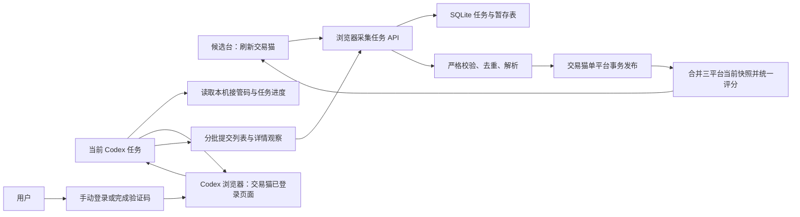

# 交易猫浏览器辅助单平台刷新设计

## 目标

Delta Account Scout 新增一条可长期使用的交易猫浏览器辅助采集链路：

1. 用户在候选台点击“刷新交易猫”；
2. 软件创建一个只针对交易猫的持久化采集任务；
3. 当前 Codex 任务接管 Codex 浏览器中的交易猫标签页；
4. 若平台要求登录或验证码，Codex 立即暂停，由用户亲自完成；
5. 验证完成后，Codex 从同一浏览器会话继续加载完整列表和详情；
6. 本地服务校验、暂存、去重、解析并评分；
7. 只有完整且可信的交易猫快照通过检查后才事务性发布；
8. 盼之与螃蟹的当前快照保持不变，但三平台候选统一重新评分。

固定业务条件保持不变：

- QQ 官服；
- M7「棱镜攻势」明确为极品 S/A/B/C；
- 价格不超过 ¥6,000；
- 展示红皮、巨浪、M7 稀有外观、资产和购买安全证据；
- 默认均衡候选池和跨平台 Top 30 使用同一套评分规则。

## 与既有设计的关系

本设计是以下规格的增量替代：

- `2026-07-28-delta-account-scout-design.md`
- `2026-07-28-full-pagination-balanced-top30-design.md`
- `2026-07-29-live-trust-risk-history-upgrade-design.md`
- `2026-07-29-trustworthy-candidate-upgrade-design.md`

仅在交易猫浏览器辅助刷新范围内，本设计替代旧规格中“登录后的浏览器只能用于人工核验，不能参与采集”的限制。

安全边界仍然成立：

- 不读取、复制、导出或保存浏览器 Cookie、密码、验证码、认证 Token、实名资料或支付信息；
- 不自动处理或绕过验证码、登录墙和平台安全检查；
- 不自动下单、联系卖家或进行任何交易操作；
- 浏览器只读取用户正常可见的交易猫列表和详情内容；
- 本地服务仍仅监听 `127.0.0.1`。

现有匿名 MTop 采集器继续作为普通“三平台刷新”的公开数据路径。浏览器辅助刷新是交易猫的独立单平台路径，不把浏览器登录态注入匿名 HTTP 采集器，也不改变盼之和螃蟹适配器。

## 方案选择

### 采用：Codex 浏览器桥梁

软件创建任务并提供本机接管协议；当前 Codex 任务读取页面可见内容，并把结构化观察分批提交给本地服务。

优点：

- 复用用户已经登录和验证的同一浏览器会话；
- 不导出会话秘密；
- 软件拥有持久化任务、校验、暂存和事务发布能力；
- 中断后可以从已提交批次继续；
- 与现有评分、异常保护和历史体系复用度最高。

限制：

- 本地网页不能自行唤醒 Codex；
- 点击按钮后，当前 Codex 任务必须继续运行或由用户在该任务中回复“已验证”“继续”；
- 登录和验证码永远需要用户亲自操作。

### 不采用：浏览器扩展

扩展可以把页面 DOM 直接发送到本地服务，减少 Codex 桥接，但需要额外安装、站点权限、升级和安全审计。本轮不引入。

### 不采用：复制粘贴导入

人工复制页面文本安全简单，但无法合理处理数百条列表与详情，也不满足长期刷新体验。本轮只保留为紧急人工降级思路，不实现。

## 架构



系统分成六个边界清晰的组件。

### `BrowserRefreshJobRepository`

负责浏览器任务和暂存批次的 SQLite 持久化：

- 创建任务；
- 记录状态、进度、游标、冷却和错误；
- 幂等接收列表与详情批次；
- 在进程重启后恢复未结束任务；
- 任务结束后使接管码失效；
- 清理超期暂存任务。

它不负责解析网页、评分或替换正式 Listing。

### `JiaoyimaoBrowserObservationSchema`

负责不可信桥接输入的严格校验：

- 只接受交易猫固定列表页和 `/jg2007840/<数字>.html` 商品页；
- 只接受允许的文本、价格、商品 ID、URL、加载序号和结束证据；
- 限制字符串长度、批次数量和累计商品数量；
- 拒绝包含 Cookie、认证头、Token、密码、验证码或脚本内容的字段；
- 将相同商品 ID 的重复观察归并为一条，保留最新合法列表字段；
- 详情只能关联本任务已发现的商品。

### `JiaoyimaoBrowserTaskService`

实现任务状态机和命令：

- 创建、接管、暂停、继续、冷却、取消和完成任务；
- 校验批次序号和任务接管凭据；
- 汇总列表、详情和加载进度；
- 判断是否满足最终发布前置条件；
- 调用既有交易猫适配器的纯解析能力或共享领域解析函数；
- 调用单平台提交服务。

### `JiaoyimaoBrowserCollector`

这是由当前 Codex 任务执行的浏览器端编排，不嵌入本地网页：

- 从候选台可见状态取得任务 ID 和一次性接管码；
- 打开或复用同一 Codex 浏览器中的交易猫标签页；
- 校验当前筛选；
- 逐步加载列表到自然末尾；
- 分批提交结构化列表观察；
- 串行打开需要核验的详情并提交证据；
- 遇到登录、验证码或明显限流时暂停任务并等待用户；
- 根据服务端游标恢复，避免重复读取已完成详情。

该组件只能使用浏览器可见页面和正常页面交互，不能访问 Cookie、localStorage、浏览器配置文件或网络认证数据。

### `SingleSourceRefreshPublisher`

新增交易猫单平台发布边界：

- 从暂存任务构造交易猫 Listing；
- 应用现有分类、证据置信度、M7 稀有外观、重复项和评分逻辑；
- 读取盼之和螃蟹当前可信正式快照；
- 只替换交易猫正式 Listing；
- 统一重新计算所有当前有效来源的集合相对评分；
- 只为交易猫写本轮来源结果和 Listing 观察；
- 不为未刷新的盼之与螃蟹生成虚假重复观察；
- 在一个 SQLite 事务中提交任务、正式快照、来源状态、扫描历史和异常保护结果。

### 前端 `JiaoyimaoBrowserRefreshPanel`

负责：

- 独立“刷新交易猫”按钮；
- 显示接管码和“等待 Codex 接管”提示；
- 轮询任务状态；
- 展示列表、详情、冷却和校验进度；
- 显示人工验证指引；
- 提供“取消本次刷新”和“继续等待”；
- 成功发布后刷新候选、来源卡片和已打开商品历史；
- 失败时继续展示上次有效快照。

## 用户流程

### 正常流程

1. 用户点击“刷新交易猫”。
2. 前端调用 `POST /api/sources/jiaoyimao/browser-refresh`。
3. 服务创建任务，返回任务 ID、一次性接管码和状态。
4. 前端显示“等待 Codex 接管”。
5. 当前 Codex 任务读取候选台上可见的任务 ID 与接管码，调用接管接口。
6. Codex 打开或复用交易猫精确筛选页。
7. Codex 校验页面筛选并加载全部商品。
8. Codex 每批提交新增列表观察。
9. 列表完成后，Codex按服务端详情待办串行核验。
10. 服务实时解析并更新暂存进度，但不改正式候选。
11. 所需详情全部完成后，Codex提交自然末页证明并请求完成任务。
12. 服务执行结构校验、数量异常保护、统一评分和事务发布。
13. 前端自动刷新交易猫来源状态、候选排名和历史。

### 人工验证流程

1. Codex发现登录页、验证码或安全验证。
2. Codex停止页面自动交互，并将任务置为 `awaiting_user_verification`。
3. 前端显示“等待你登录/验证”，旧快照继续可用。
4. 用户在同一个 Codex 浏览器标签页亲自完成验证。
5. 用户在当前 Codex 任务回复“已验证”。
6. Codex检查页面已经恢复到正常交易猫列表或详情，再将任务恢复为采集状态。
7. 服务端返回最后确认的批次和详情游标，Codex从断点继续。

验证失败或页面仍受阻时，不增加请求频率，也不改正式快照。

## 精确筛选与完整列表

交易猫浏览器采集只接受以下范围：

- 游戏：三角洲行动；
- 平台：QQ；
- 商品分类：账号；
- 武器皮肤：M7 战斗步枪「棱镜攻势」；
- 品质：极品 S、极品 A、极品 B、极品 C。

Codex在采集前必须验证页面 URL 或页面可见筛选摘要能证明上述条件。若无法证明，则把任务置为 `filter_mismatch`，不采集商品。

列表采用页面自身的正常加载方式。每次加载后记录：

- 当前可见唯一商品总数；
- 新增商品 ID；
- 页面加载序号；
- 页面可见的总数或末尾提示（如果存在）；
- 是否出现阻塞或错误提示。

满足下列任一条件才可声明自然结束：

1. 页面提供明确的末页或总数，唯一商品数与之相符；
2. 连续两次正常加载后唯一商品数不再增长，且页面未显示加载中、错误、验证码或登录提示。

为防止页面异常循环，单任务保留 2,000 个唯一商品和 100 次加载动作的硬上限。命中上限时任务进入 `safety_limit`，不能发布为完整成功。

## 详情覆盖范围

所有列表商品都进入暂存区。

- 列表价格明确超过 ¥6,000：无需访问详情即可按预算淘汰；
- 价格不超过 ¥6,000 或价格未知：必须读取详情；
- 详情必须取得足以运行现有分类规则的页面可见证据；
- 新出现、价格变化或详情证据变化的商品必须形成新观察；
- 仅有旧缓存而本轮未成功打开详情的预算内商品不能进入本轮合格候选。

详情提取字段与现有模型保持一致：

- 登录平台和服务器；
- M7 棱镜攻势及极品 S/A/B/C；
- 珠光、炫彩、糖果等 M7 稀有外观；
- 角色红皮和巨浪；
- 总资产和哈夫币；
- 实名、二次实名、找回包赔；
- 验号时间和封禁提示；
- 商品标题、价格、商品 ID、原始 URL；
- 可追溯的页面可见证据文本。

单条详情结构变化或证据不足时，该商品进入待人工核验；详情页登录/验证码阻塞则暂停整个浏览器任务，等待用户处理。

## 任务状态机

任务状态使用以下稳定值：

```text
awaiting_codex
collecting_list
collecting_details
awaiting_user_verification
cooling_down
validating
committing
success
paused
failed
cancelled
expired
```

附加 `stage` 与 `reason` 表达更具体的错误，如：

```text
filter_mismatch
captcha_required
login_required
rate_limited
structure_changed
no_progress
safety_limit
staging_invalid
anomaly_quarantined
process_interrupted
```

状态转换原则：

- `awaiting_codex` 只能由合法接管进入采集；
- 采集状态可进入人工验证、冷却、暂停、失败或校验；
- `awaiting_user_verification` 只能由 Codex确认页面恢复后继续；
- `validating` 失败不能进入 `committing`；
- `success`、`failed`、`cancelled` 和 `expired` 是终态；
- 任何终态都使接管码失效；
- 进程启动时，遗留在 `committing` 的任务标为 `failed/process_interrupted`；
- 其它未结束任务恢复为 `paused/process_interrupted`，保留断点；
- 同一时间只允许一个未结束的交易猫浏览器任务。

## 冷却与退避

正常采集保持串行：

- 列表加载动作之间加入轻量随机等待；
- 详情访问之间保持保守随机间隔；
- 不并发打开多个详情页；
- 不在后台无界重试。

出现明确限流但没有验证码时进入 `cooling_down`。连续受阻的默认退避为：

```text
30 秒 → 2 分钟 → 5 分钟 → 15 分钟
```

每次冷却结束只尝试一次当前动作。成功取得正常页面后，连续受阻计数清零。第四次冷却后仍受阻则进入 `paused/rate_limited`，等待用户稍后手动继续。

验证码或登录墙不走自动冷却重试，直接进入 `awaiting_user_verification`。

## 持久化模型

### `browser_refresh_jobs`

```text
id
source
state
stage
reason
claim_code_hash
bridge_token_hash
claimed_at
created_at
updated_at
finished_at
expires_at
list_batch_cursor
detail_completed_count
detail_required_count
unique_item_count
load_action_count
cooldown_attempt
cooldown_until
filter_url
last_error
published_run_id
```

约束：

- `source` 本轮只允许 `jiaoyimao`；
- 同时最多一个非终态任务；
- 计数非负；
- 接管码只保存带随机盐的安全哈希；
- 接管成功后立即使接管码失效，短期桥接凭据也只保存带随机盐的安全哈希；
- `published_run_id` 只能在成功提交后设置。

### `browser_refresh_list_items`

```text
job_id
source_listing_id
url
title
raw_text
price_cny
last_batch_sequence
observed_at
```

主键为 `(job_id, source_listing_id)`。

### `browser_refresh_details`

```text
job_id
source_listing_id
url
evidence_json
observed_at
```

主键为 `(job_id, source_listing_id)`，并引用同任务列表商品。

### `browser_refresh_batches`

```text
job_id
kind
sequence
payload_hash
accepted_count
created_at
```

主键为 `(job_id, kind, sequence)`。相同序号与相同哈希重传返回原结果；相同序号但不同哈希拒绝。

任务成功、取消、失败或过期后可清理大体积暂存行，但保留轻量任务审计记录。暂停任务默认保留 24 小时。

## 本地 API

### 用户与前端接口

```text
POST   /api/sources/jiaoyimao/browser-refresh
GET    /api/sources/jiaoyimao/browser-refresh/current
POST   /api/sources/jiaoyimao/browser-refresh/:id/cancel
POST   /api/sources/jiaoyimao/browser-refresh/:id/keep-waiting
```

创建接口返回：

```json
{
  "jobId": "opaque-id",
  "state": "awaiting_codex",
  "claimCode": "one-time-visible-code",
  "expiresAt": "ISO-8601"
}
```

前端不会把接管码写入 `localStorage` 或日志。刷新页面后通过当前任务接口取得脱敏状态；若接管码尚未使用但页面丢失，用户取消旧任务并创建新任务。

### Codex 桥接接口

```text
POST /api/browser-refresh/:id/claim
GET  /api/browser-refresh/:id/work
POST /api/browser-refresh/:id/list-batches
POST /api/browser-refresh/:id/details
POST /api/browser-refresh/:id/pause
POST /api/browser-refresh/:id/resume
POST /api/browser-refresh/:id/cooldown
POST /api/browser-refresh/:id/complete
```

接管成功后返回内存中的短期桥接凭据；服务端只保存其哈希。后续写接口要求：

- 正确任务 ID；
- 正确桥接凭据；
- 合法状态转换；
- 严格结构校验；
- 有界请求体；
- 本机来源。

桥接凭据不进入数据库明文、日志、Listing 证据或浏览器页面。任务终止或 24 小时过期后失效。

## 单平台发布与历史

现有 `scan_runs` 增加刷新范围：

```text
scope = all_sources | single_source
requested_source = nullable SourceId
```

浏览器任务发布时：

1. 只生成一条交易猫 `scan_source_results`；
2. 不为盼之和螃蟹创建来源结果；
3. 只为本轮可信交易猫商品写 `listing_observations`；
4. 对本轮可信完整交易猫快照生成 active/removed 历史；
5. 盼之和螃蟹的上次观察不变；
6. 正式 `listings` 表保留两平台记录，只替换交易猫记录；
7. 以所有当前有效来源的正式 Listing 重新运行重复检测和统一评分；
8. 更新交易猫 `source_status`；
9. 在同一事务内完成正式 Listing、来源状态、异常保护、扫描历史、任务成功状态和 `published_run_id`。

如果提交失败，整个事务回滚，任务进入 `failed`，三个平台正式快照与历史均保持提交前状态。

## 数量异常保护

继续使用现有可信基线和两次确认规则：

- 商品数低于基线一半且至少减少 10 条；
- 或加载页/动作数低于基线一半且至少减少 2；
- 第一次异常完整结果进入隔离，旧快照继续发布；
- 下一次独立完整刷新出现相近低量结果才确认；
- 登录、验证码、结构错误、`safety_limit`、取消和未完整详情不能确认低量；
- 恢复到正常区间会清除异常保护。

浏览器任务出现 `anomaly_quarantined` 时，本次扫描历史必须明确记录“完整采集但未发布”，前端不得显示成普通成功。

## 前端体验

主标题区域保留“三平台刷新公开数据”，并增加交易猫来源卡片上的独立按钮“刷新交易猫”。

浏览器任务面板按状态显示：

- 等待 Codex 接管；
- 等待你登录/验证；
- 加载列表：已发现 N 条，加载动作 M 次；
- 读取详情：已完成 X / Y；
- 冷却中：剩余时间；
- 校验与评分；
- 已完成：发布 N 条，合格 N 条；
- 已隔离：数量异常，继续使用旧快照；
- 已暂停或失败：原因、断点和恢复建议。

任务运行期间：

- 三平台普通刷新按钮禁用，避免两个刷新事务竞争；
- 旧候选和详情保持可浏览；
- 其它标签页通过现有 `BroadcastChannel` 和轮询发现任务状态；
- 任务成功后自动刷新当前候选视图、来源卡片、扫描历史和已打开商品历史；
- 页面刷新或重开后可以重新读取当前任务状态；
- 用户可以取消任务，但取消确认文案必须说明“不会删除现有候选数据”。

## 错误处理

| 情况 | 任务结果 | 正式快照 |
| --- | --- | --- |
| 登录或验证码 | 等待人工验证 | 保留 |
| 筛选条件不匹配 | 暂停 `filter_mismatch` | 保留 |
| 短期限流 | 冷却并单次重试 | 保留 |
| 多次限流 | 暂停 `rate_limited` | 保留 |
| 页面结构变化 | 暂停或失败 | 保留 |
| 列表未到自然末页 | 暂停/失败 | 保留 |
| 预算内详情未完成 | 暂停/失败 | 保留 |
| 数量第一次异常下降 | 隔离 | 保留 |
| 批次结构或哈希冲突 | 失败 `staging_invalid` | 保留 |
| SQLite 提交失败 | 失败并回滚 | 保留 |
| 用户取消 | 取消并清理暂存 | 保留 |
| 软件中断 | 恢复为暂停并保留游标 | 保留 |
| 任务超过 24 小时 | 过期 | 保留 |

所有对外错误使用稳定错误码和中文说明，不回显接管凭据、页面隐私内容或底层 SQL。

## 测试设计

### 领域与单元测试

- 任务状态转换允许和拒绝矩阵；
- 接管码与桥接凭据哈希验证、终态失效和过期；
- 交易猫 URL、商品 ID、字段长度和敏感字段拒绝；
- 列表批次幂等重传与哈希冲突；
- 重复商品归并和详情外键；
- 自然末页判定；
- 详情覆盖清单；
- 冷却阶梯和成功清零；
- 进程中断恢复；
- 暂存任务过期清理。

### Repository 与 API 测试

- 创建、读取、接管、取消和恢复任务；
- 同时只能存在一个交易猫浏览器任务；
- 非法状态、无凭据和错误凭据拒绝；
- 批次大小和累计安全上限；
- 单平台事务提交保留盼之和螃蟹；
- 只写交易猫来源结果和观察；
- 三平台重新评分；
- 提交失败完整回滚；
- 第一次低量隔离和第二次确认；
- 普通三平台刷新与浏览器任务互斥；
- 旧数据库幂等迁移。

### 前端测试

- 独立按钮创建任务；
- 接管码只在创建后显示；
- 所有任务状态及进度文案；
- 登录/验证码指引；
- 冷却倒计时；
- 刷新页面后恢复状态；
- 成功后重新加载候选和历史；
- 失败、暂停、隔离时保留旧候选；
- 取消确认与结果；
- 多标签同步；
- 移动端状态面板不遮挡候选详情。

### 完整自动化验证

```bash
pnpm test
pnpm typecheck
pnpm build
git diff --check
```

## 真实数据验收

使用独立验收数据库，保留验收前备份。

1. 在本地候选台点击“刷新交易猫”；
2. 当前 Codex 任务读取任务并接管；
3. 在 Codex 浏览器打开精确交易猫筛选页；
4. 如有登录或验证码，由用户亲自完成；
5. 从同一页面加载至自然末尾；
6. 记录唯一商品数、加载动作数和结束依据；
7. 对所有价格不超过 ¥6,000 或价格未知的商品完成详情；
8. 确认服务端详情完成数等于详情待办数；
9. 完成任务并检查发布状态；
10. 核对至少三条商品的价格、M7 品质、稀有外观、资产和安全证据；
11. 核对交易猫合格数、均衡候选贡献和全局 Top 30；
12. 核对盼之和螃蟹 Listing 数与历史未被删除或伪造；
13. 核对扫描历史为 `single_source/jiaoyimao`；
14. 执行 `PRAGMA integrity_check`；
15. 在 Codex 浏览器验收按钮、进度、成功状态、来源卡片和候选排名。

真实商品数量会随平台库存变化，验收不硬编码某个历史数量。完整性由自然末页证据、唯一 ID、详情覆盖和异常保护共同证明。

## 完成标准

只有以下条件全部满足才视为完成：

- 软件存在可用的“刷新交易猫”单平台按钮；
- 点击后能建立持久化、可接管、可恢复的浏览器任务；
- 用户可在同一 Codex 浏览器会话亲自处理登录或验证码；
- 验证后能从断点继续完整列表和详情采集；
- 不读取或保存浏览器会话秘密；
- 冷却、暂停、失败、取消、过期和进程中断行为明确；
- 只有完整可信结果能事务发布；
- 单平台发布正确接入现有评分、异常保护和历史；
- 盼之和螃蟹数据在交易猫刷新中保持完整；
- 自动化测试、类型检查和构建通过；
- 完成一次真实交易猫数据验收；
- 完成 Codex 浏览器界面验收；
- 代码和文档提交并推送到 `master`。

## 非目标

- 不让网页自动唤醒 Codex；
- 不安装浏览器扩展；
- 不导入浏览器 Cookie 或本地存储；
- 不绕过验证码或平台限流；
- 不刷新盼之和螃蟹；
- 不自动购买账号；
- 不改变预算、平台、M7 品质或候选池业务规则。
